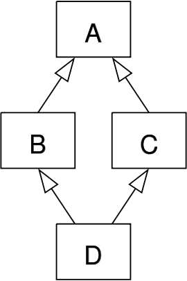

# Парадигма наследования
Наследование — одна из самых важных и мощных парадигм ООП. При наследовании мы оперируем такими понятиями, как родительский класс и класс потомок. Класс-потомок наследует методы и переменные, определенные в родительском классе. Рассмотрим на примере:

```python
class A:
    var_A = 1

    def method_A(self):
        print("A")


class B(A):
    var_B = 2

    def method_B(self):
        print("B")


class C(B):
    var_C = 3

    def method_C(self):
        print("C")


print("A:\t", list(filter(lambda x: "__" not in x, dir(A))))
print("B(A):\t", list(filter(lambda x: "__" not in x, dir(B))))
print("C(B):\t", list(filter(lambda x: "__" not in x, dir(C))))
print()
```
```console
A:	 ['method_A', 'var_A']
B(A):	 ['method_A', 'method_B', 'var_A', 'var_B']
C(B):	 ['method_A', 'method_B', 'method_C', 'var_A', 'var_B', 'var_C']
```

При наследовании класс-потомок может переопределять методы и переменные родительского класса:

```python
class A:
    value = 13

    def some_method(self):
        print(f"Method in A, value = {self.value}")


class B(A):

    def some_method(self):
        print(f"Method in B, value = {self.value}")


class C(B):
    value = 6

    def some_method(self):
        print(f"Method in C, value = {self.value}")


A().some_method()
B().some_method()
C().some_method()
print()
```
```console
Method in A, value = 13
Method in B, value = 13
Method in C, value = 6
```

Множественное наследование позволяет получить доступ к атрибутам нескольких родительских классов:

```python
class A:

    def some_function(self):
        print("First function")

    def other_function(self):
        print("Second function")


class B:

    def method_in_B(self):
        print("Third function")


class С(A, B):

    pass


# Посмотрим все атрибуты класса, не являющиеся служебными
print("A:\t", list(filter(lambda x: "__" not in x, dir(A))))
print("B:\t", list(filter(lambda x: "__" not in x, dir(B))))
print("С(A,B):\t", list(filter(lambda x: "__" not in x, dir(С))))
print()
```
```console
A:	 ['other_function', 'some_function']
B:	 ['method_in_B']
С(A,B):	 ['method_in_B', 'other_function', 'some_function']
```

Одна из проблем множественного наследования — **Ромб Смерти** (Diamond Inheritance).



При этом класс-наследник не знает, какую из реализаций некоторого метода следует выбрать. Эта проблема решается при помощи виртуального наследования. При этом вместо наследования реализации метода в класс-потомок передается ссылка на метод родительского класса. Однако, если классы-потомки первого уровня оба переопределяют некоторый метод, все еще остается вопрос, какая из реализаций должна передаваться потомку второго уровня. Для этого в Python версии 2.3 и выше применяется механизм С3-линеаризации. Рассмотрим несколько примеров.

```python
# Пример без переопределения метода
class A:
    value = 13

    def some_method(self):
        print(f"Method in A, value = {self.value}")


class B(A):
    pass


class C(A):
    pass


class D(B, C):
    pass

# Рассмотрим реализацию в D
D().some_method()
print()
```
```console
Method in A, value = 13
```

```python
# Переопределим метод в D
class A:
    value = 13

    def some_method(self):
        print(f"Method in A, value = {self.value}")


class B(A):
    pass


class C(A):
    pass


class D(B, C):

    def some_method(self):
        print(f"Method in D, value = {self.value}")

# Рассмотрим реализацию в D
D().some_method()
print()
```
```console
Method in D, value = 13
```

```python
# Переопределим метод в C
class A:
    value = 13

    def some_method(self):
        print(f"Method in A, value = {self.value}")


class B(A):
    pass


class C(A):

    def some_method(self):
        print(f"Method in С, value = {self.value}")

class D(B, C):
    pass

# Рассмотрим реализацию в D
D().some_method()
print()
```
```console
Method in С, value = 13
```

```python
# Переопределим метод в  B и C b значение в С
class A:
    value = 13

    def some_method(self):
        print(f"Method in A, value = {self.value}")


class B(A):

    def some_method(self):
        print(f"Method in B, value = {self.value}")


class C(A):
    value = 6

    def some_method(self):
        print(f"Method in С, value = {self.value}")

class D(B, C):
    pass

# Рассмотрим реализацию в D
D().some_method()
print()
```
```console
Method in B, value = 6
```


