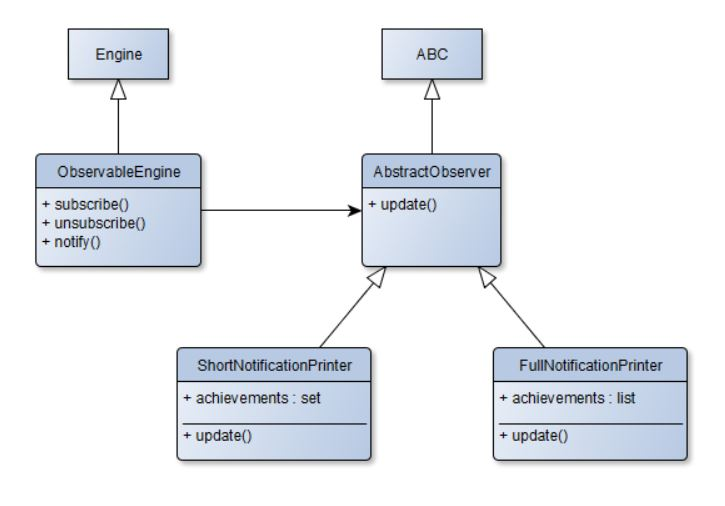

# Паттерн Наблюдатель

Продолжая работу над игрой, вы добрались до системы достижений. Иногда игре нужно наградить игрока за то, что он достигает определенного результата в игре. Это может быть, например, прохождение всех заданий в игре, достижение определенного уровня, совершение какого-то сложного действия и т.д.

У каждой игры есть движок и интерфейс пользователя. Это два компонента, которые работают параллельно и взаимодействуют друг с другом. Достижения генерируются движком игры, а отображаются пользовательским интерфейсом. Кроме того, на современных игровых площадках, таких как _Steam_, _Google Play_, также отображаются достижения, полученные игроком. Для этого применяется как раз паттерн **Наблюдатель**.

У вас есть движок `Engine`, который может создавать уведомления о достижениях. Вам необходимо написать обертку над движком, которая будет иметь возможность подписывать наблюдателей и рассылать им уведомления, а также иерархию наблюдателей. В иерархию наблюдателей должны входить _абстрактный наблюдатель_, `AbstractObserver`, от которого унаследованы 2 наблюдателя `ShortNotificationPrinter` и `FullNotificationPrinter`. Первый из них составляет множество названий полученных достижений, второй составляет список достижений в том порядке, в котором они даны в системе. Имейте в виду, что каждое достижение должно быть учтено только один раз.

Иерархия классов приведена на следующей UML диаграмме:



Пример достижения, которое генерирует движок:

```python
{"title": "Покоритель", "text": "Дается при выполнении всех заданий в игре"}
```

Метод `update` не должен возвращать никаких значений, он должен только изменять переменную `achievements`.

Класс `Engine` реализовывать не нужно!

