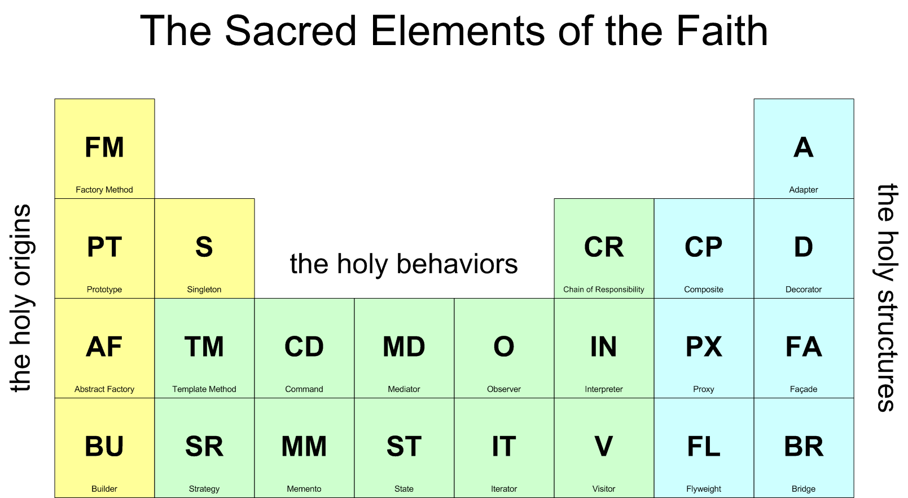

# Паттерны проектирования

## Основные понятия

**Паттерн проектирования (design pattern)** — повторяемая архитектурная конструкция, применяемая для решения часто встречающихся задач.

Паттерны проектирования — это не готовые куски кода, написанные на некотором языке. Это некоторые общие архитектурные решения, которые можно применять при решении задач. Они требуют доработки под каждую конкретную задачу.

При описании любого паттерна проектирования обычно говорят о следующих понятиях:

- Задача, для решения которой применяется паттерн проектирования
- Достоинства применения данного паттерна при решении задачи перед другими методами
- Диаграмма классов, описывающая структуру паттерна
- Пример реализации паттерна

## Классификация паттернов проектирования
Существует большое количество различных паттернов проектирования. Для комфортной работы с ними, их можно разделить на группы. Первый естественный признак, по которому можно делить паттерны — это уровень абстракции. Самые низкоуровневые паттерны существуют на уровне языка программирования и описывают решение довольно узкой задачи средствами конкретного языка. Такие паттерны называются идиомами.

Паттерны наиболее высокого уровня называют архитектурными шаблонами. Они описывают не просто решение некоторой конкретной задачи, а подход к созданию целой информационной системы. Архиектурные шаблоны абсолютно не привязаны к языку программирования и могут быть реализованы на практически любом языке.

К архитектурным шаблонам относятся, например, такие шаблоны, как:

- Model-View-Controller (MVC)
- Model-View-Presenter
- Model-View-View Model
- Presentation-Abstraction-Control
- Naked objects
- Hierarchical Model-View-Controller
- View-Interactor-Presenter-Entity-Routing (VIPER)

Паттерны промежуточного уровня как раз обычно и называют паттернами проектирования. Однако, даже в этой категории находится огромное количество шаблонов. Их тоже необходимо классифицировать.

Паттерны обычно делать на 3 основных категории: структурные, поведенческие и порождающие. Разберемся с каждой из категорий.

## Структурные шаблоны
**Структурные шаблоны** модифицируют структуру объектов. Они могут служить для получения из классов более сложных структур или альтернативной реализации доступа к объектам.

К структурным шаблонам относятся следующие шаблоны:

- [Адаптер](https://refactoring.guru/uk/design-patterns/adapter) (Adapter) – взаимодействие несовместимых объектов
- Мост (Bridge) – разделение абстракции и реализации
- [Компоновщик](https://refactoring.guru/uk/design-patterns/composite) (Composite) – агрегирование нескольких объектов в одну структуру
- [Декоратор](https://refactoring.guru/uk/design-patterns/decorator) (Decorator) – динамическое создание дополнительного поведения объекта
- [Фасад](https://refactoring.guru/uk/design-patterns/facade) (Facade) – сокрытие сложной структуры за одним объектом, являющимся общей точкой доступа
- [Приспособленец](https://refactoring.guru/uk/design-patterns/flyweight) (Flyweight) – общий объект, имеющий различные свойства в разных местах программы
- [Заместитель](https://refactoring.guru/uk/design-patterns/proxy) (Proxy) – контроль доступа к некоторому объекту

## Порождающие шаблоны
**Порождающие шаблоны** используются при создании различных объектов. Они призваны разделить процесс создания объектов и использования их системой. Это может применяться для реализации способа создания объектов независимо от типа создаваемого объекта или для сокрытия процесса создания объекта от системы.

К порождающим шаблонам относятся следующие паттерны:

- [Абстрактная фабрика](https://refactoring.guru/uk/design-patterns/abstract-factory) (Abstract factory) — создание семейств взаимосвязанных объектов
- [Строитель](https://refactoring.guru/uk/design-patterns/builder) (Builder) — сокрытие инициализации для сложного объекта
- [Фабричный метод](https://refactoring.guru/uk/design-patterns/factory-method) (Fаctory method) — общий интерфейс создания экзкмпляров подклассов некоторого класса
- Отложенная инициализация (Lazy initialization) — создание объекта только при доступе к нему
- Пул одиночек/Объектный пул (Multiton/Object pool) — повторное использование сложных объектов вместо повторного создания
- [Прототип](https://refactoring.guru/uk/design-patterns/prototype) (Prototype) — упрощение создания объекта за счет клонирования уже имеющегося
- [Одиночка](https://refactoring.guru/uk/design-patterns/singleton) (Singleton) — объект, присутствующий в системе в единственоом экземпляре

## Поведенческие паттерны
**Поведенческие паттерны** описывают способы реализации взаимодействия между объектами различных типов. При таком взаимодействии объекты часто могут решить гораздо более сложные задачи, чем могли бы решить по-отдельности.

К поведенческим паттернам относятся такие паттерны, как:

- [Цепочка обязанностей](https://refactoring.guru/uk/design-patterns/chain-of-responsibility) (Chain of Responsibility) — обработка данных несколькими объектами
- Интерпретатор (Interpreter) — решение частой незначительно изменяющейся задачи
- [Итератор](https://refactoring.guru/uk/design-patterns/iterator) (Iterator) — последовательный доступ к объекту-коллекции
- [Хранитель](https://refactoring.guru/uk/design-patterns/memento) (Memento) — сохранение и восстановление объекта
- [Наблюдатель](https://refactoring.guru/uk/design-patterns/observer) (Observer) — оповещение об изменении некоторого объекта
- [Состояние](https://refactoring.guru/uk/design-patterns/state) (State) — изменение поведения в зависимости от состояния
- [Стратегия](https://refactoring.guru/uk/design-patterns/strategy) (Strategy) — выбор из нескольких вариантов поведения объекта
- [Посетитель](https://refactoring.guru/uk/design-patterns/visitor) (Visitor) — выполнение некоторой операции над группой различных объектов