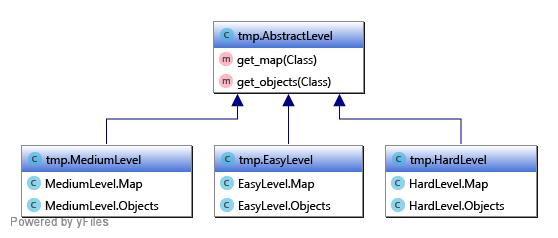

# Реализуйте абстрактную фабрику

Вам даны шесть классов: `EasyMap`, `EasyObjects`, `MediumMap`, `MediumObjects`, `HardMap`, `HardObjects`. Каждый из классов генерирует карту и список объектов для неё.

На их основе Вам необходимо создать абстрактную фабрику `AbstractLevel` c классовыми методами `get_map()` и `get_objects()`. Её реализации должны носить имена `EasyLevel`, `MediumLevel` и `HardLevel`.



```python
import random


class EasyMap:

    def __init__(self):
        self._map = [[0 for j in range(5)] for i in range(5)]
        for i in range(5):
            for j in range(5):
                if i == 0 or j == 0 or i == 4 or j == 4:
                    # граница карты
                    self._map[j][i] = -1
                else:
                    # случайная характеристика области
                    self._map[j][i] = random.randint(0, 2)

    def get_map(self):
        return self._map


class EasyObjects:

    def __init__(self):
        # размещаем переход на след. уровень
        self.objects = [('next_lvl', (2, 2))]

    def get_objects(self, map_obj):
        # размещаем противников
        for obj_name in ['rat']:
            coord = (random.randint(1, 3), random.randint(1, 3))
            # ищем случайную свободную локацию
            intersect = True
            while intersect:
                intersect = False
                for obj in self.objects:
                    if coord == obj[1]:
                        intersect = True
                        coord = (random.randint(1, 3), random.randint(1, 3))

            self.objects.append((obj_name, coord))

        return self.objects


class MediumMap:

    def __init__(self):
        self._map = [[0 for j in range(8)] for i in range(8)]
        for i in range(8):
            for j in range(8):
                if i == 0 or j == 0 or i == 7 or j == 7:
                    # граница карты
                    self._map[j][i] = -1
                else:
                    # случайная характеристика области
                    self._map[j][i] = random.randint(0, 2)

    def get_map(self):
        return self._map


class MediumObjects:

    def __init__(self):
        # размещаем переход на след. уровень
        self.objects = [('next_lvl', (4, 4))]

    def get_objects(self, map_obj):
        # размещаем врагов
        for obj_name in ['rat', 'snake']:
            coord = (random.randint(1, 6), random.randint(1, 6))
            # ищем случайную свободную локацию
            intersect = True
            while intersect:
                intersect = False
                for obj in self.objects:
                    if coord == obj[1]:
                        intersect = True
                        coord = (random.randint(1, 6), random.randint(1, 6))

            self.objects.append((obj_name, coord))

        return self.objects


class HardMap:

    def __init__(self):
        self._map = [[0 for j in range(10)] for i in range(10)]
        for i in range(10):
            for j in range(10):
                if i == 0 or j == 0 or i == 9 or j == 9:
                    # граница карты
                    self._map[j][i] = -1
                else:
                    # характеристика области (-1 для непроходимой обл.)
                    self._map[j][i] = random.randint(-1, 8)

    def get_map(self):
        return self._map


class HardObjects:

    def __init__(self):
        # размещаем переход на след. уровень
        self.objects = [('next_lvl', (5, 5))]

    def get_objects(self, map_obj):
        # размещаем врагов
        for obj_name in ['rat', 'snake']:
            coord = (random.randint(1, 8), random.randint(1, 8))
            # ищем случайную свободную локацию
            intersect = True
            while intersect:
                intersect = False
                if map_obj.get_map()[coord[0]][coord[1]] == -1:
                    intersect = True
                    coord = (random.randint(1, 8), random.randint(1, 8))
                    continue
bj in self.objects:
                    if coord == obj[1]:
                        intersect = True
                        coord = (random.randint(1, 8), random.randint(1, 8))

            self.objects.append((obj_name, coord))

       .obje
```