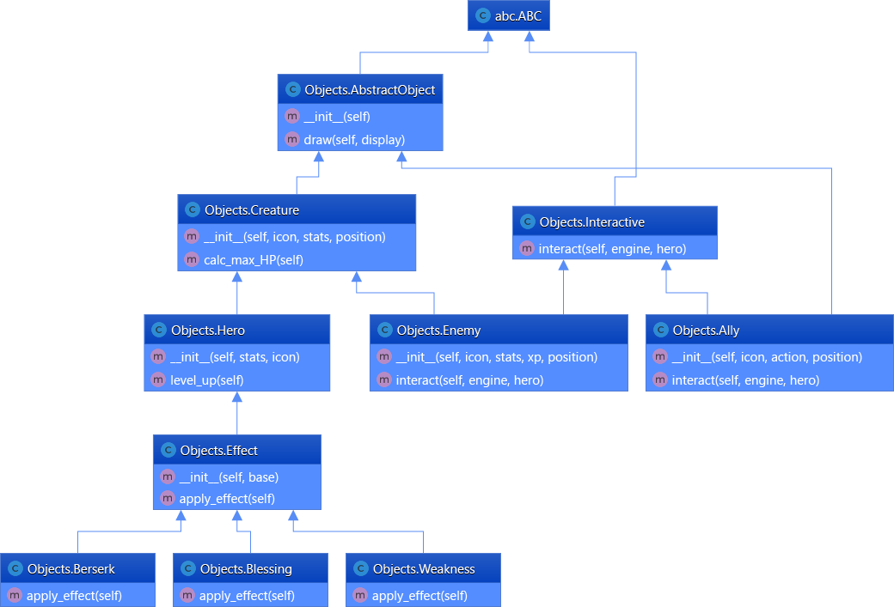
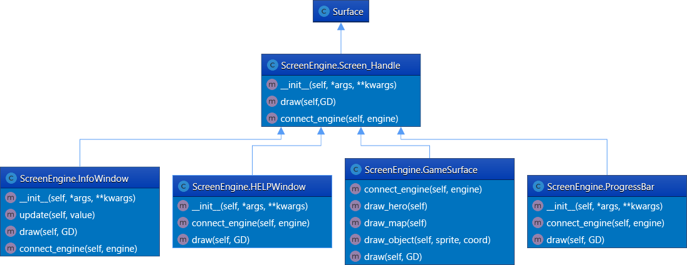
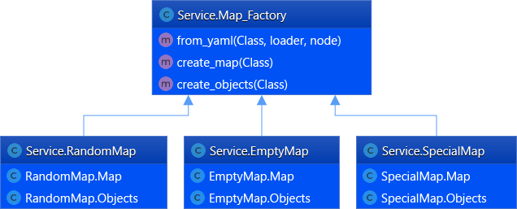

# Игра «Рыцарь в подземелье»

В данном задании Вам необходимо будет закончить разработку полноценной ролевой игры «Рыцарь в подземелье». В данной игре необходимо будет играть за рыцаря, который путешествует по многоэтажному подземелью, борется с врагами и собирает сокровища.

Вам будет дан код движка игры, текстуры и игровая логика. Некоторые из классов и методов изначально не реализованы в предоставленном коде. Их и необходимо будет реализовать в данном задании. В помощь вам будут даны полные диаграммы классов, которые должны быть представлены в проекте.

Кроме реализации новых методов, необходимо будет дописать недостающий код в некоторые из существующих функций и методов. Места, в которых требуется исправление, помечены меткой `#FIXME`.

Кроме основных заданий, Вам будут предложены дополнительные задания. В них вам нужно будет немного усовершенствовать игру. При выполнении дополнительных заданий старайтесь быть креативными.

В качестве ответа вам необходимо будет прикрепить архив, содержащий всю структуру папок Вашего проекта.

1. Должны быть реализованы все необходимые классы;
2. Схема наследования должна соответствовать заданной;
3. Программа должна корректно выполняться с исходными YAML файлами;
4. Реализация дополнительных заданий

Objects.py

ScreenEngine.py:

Service.py:

### Дополнительные задачи:

1. Реализованы собственный противник и союзник;
2. Добавлена отрисовка миникарты;
3. Реализован дополнительный эффект.